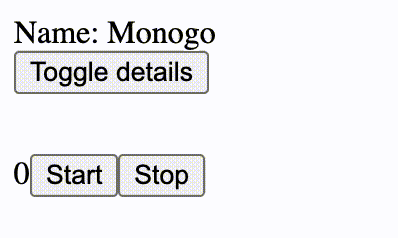
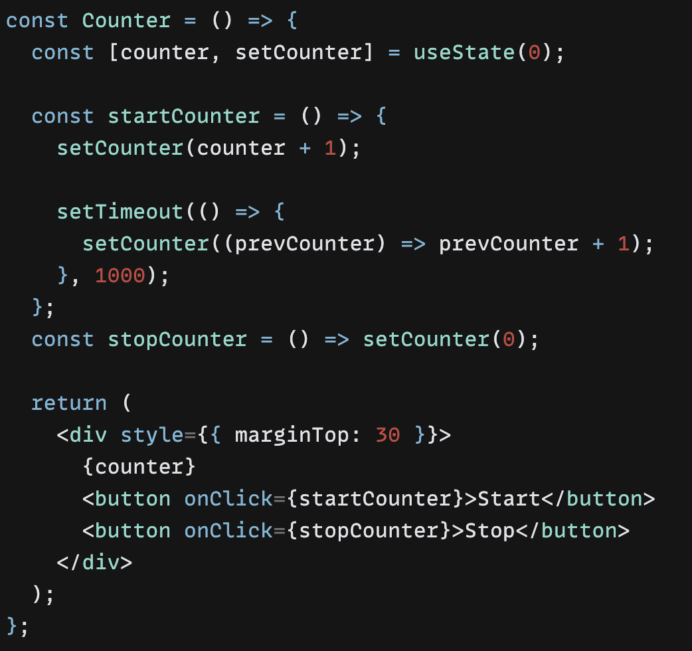
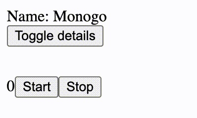
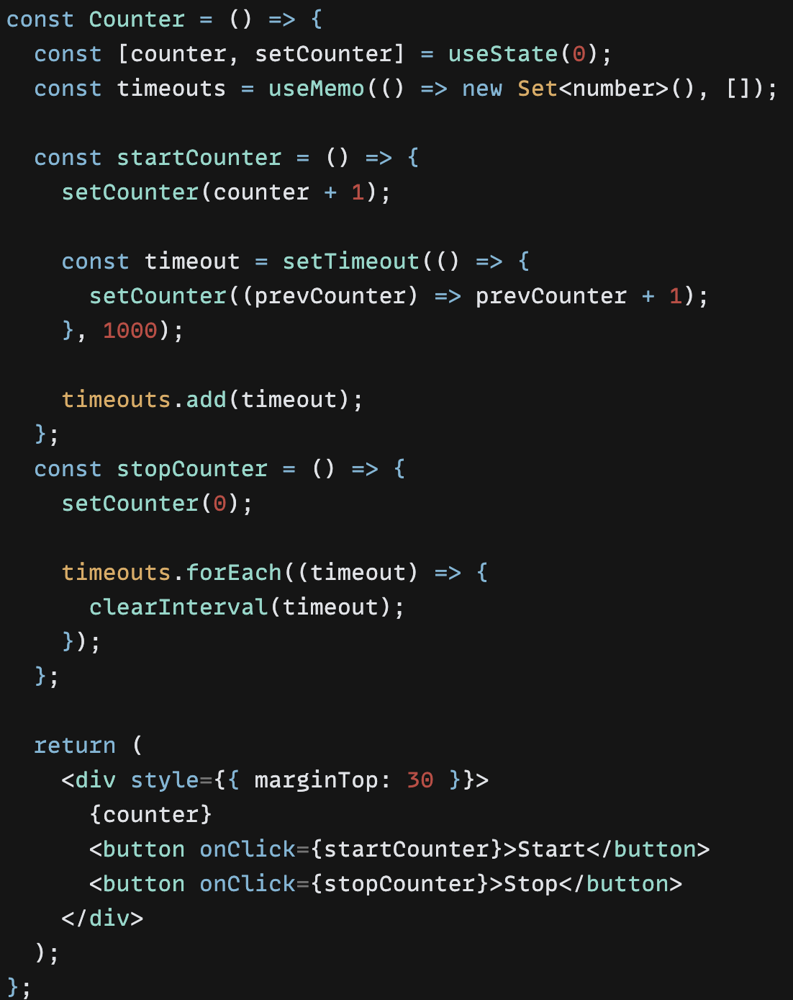
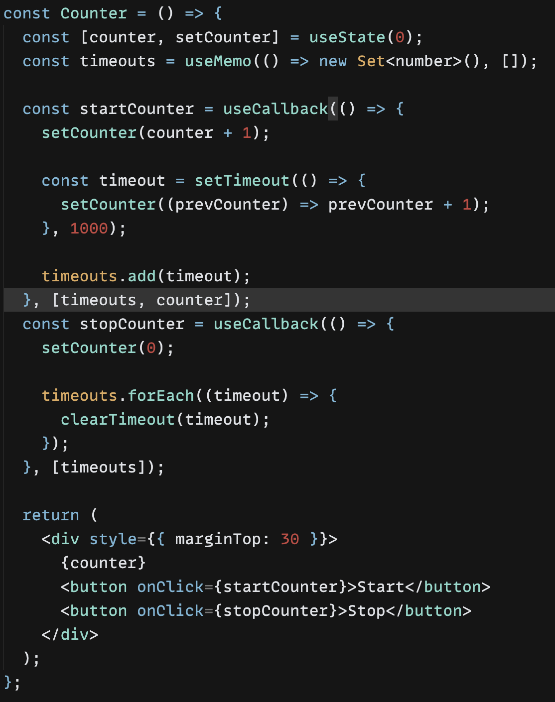
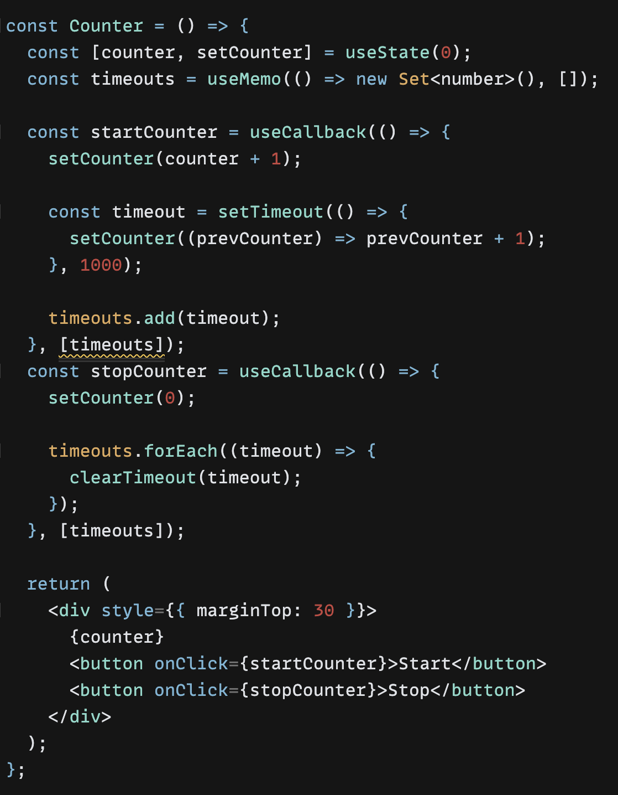
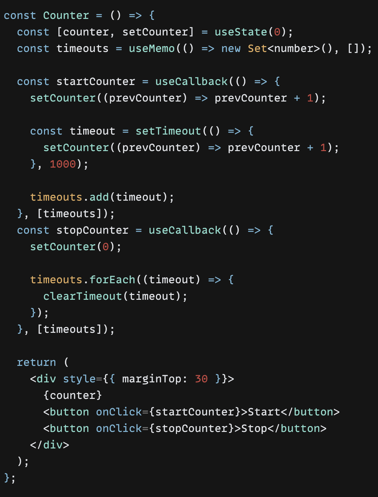

# Task 2

code review - [project link](https://codesandbox.io/s/serverless-frost-h2t13).

## Part 1

- ### Changes

  - move `detailedInfo` outside of the component
    (component: `App`)
  - export default => name export
  - destructuring (`DetailedInfo` component)
  - using `useCallback` for a stable reference
    (especially important when passing a function to another component as props)
  - react context prevents props drilling
    (components: `InnerFirst`, `InnerSecond`, `InnerThird`)

## Part 2

### Incessant rerenders after invoke startCounter

Hook `useEffect` executes after painting, which is caused by rerender (unless in `useLayoutEffect` we call `setState` which causes rerender in which case painting is postponed and `useEffect` is moved)

The function `startCounter` causes a rerender, which results in the call to `useEffect`. In our case, the logic of `useEffect` is the next increment of the counter. As a result, we receive a lot of rerenders.

**solution:**

**setCounter callback:**
The `setCounter` function is asynchronous, so when the `setTimeout` function is called, the closure of the `startCounter` action is from the first render.

### Timeouts in the queue task

**event loop:** Timeouts are part of the webapi so they go to the queue task and when the stack is empty they are executed one at a time.

After removing the functions `startCounter` and `stopCounter` from the stack, the previously queued timeouts can be performed.

**solution:**

**description:** Removing saved timeouts from the queue task.

### Memoization

After that memoization we receive zero benefits, so lets remove counter dependency. In order to stable refference.

But it does't work, because function has the same closure between rerenders. We can avoid this problem by passing callback to `setCounter`.

**solution:**

